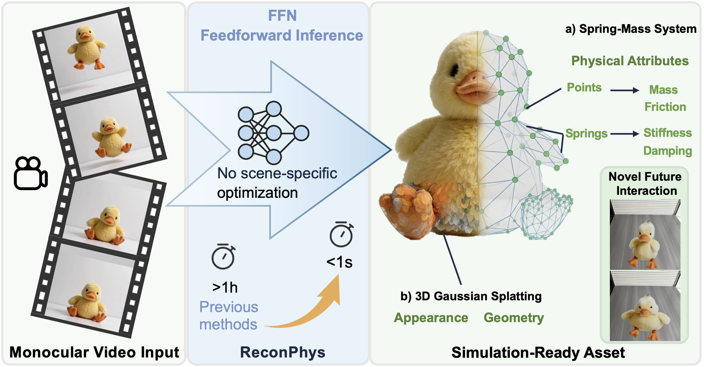

## ReconPhys: Reconstruct Appearance and Physical Attributes from Single Video
[Paper](https://arxiv.org/abs/2604.07882) | [Project Page](https://chuanshuogushi.github.io/ReconPhys/)



## Abstract
Reconstructing non-rigid objects with physical plausibility remains challenging due to expensive per-scene optimization and the lack of physical supervision. ReconPhys is a feedforward framework that jointly learns physical attribute estimation and 3D Gaussian Splatting reconstruction from a single monocular video. A dual-branch architecture with a differentiable simulation-rendering loop enables self-supervised learning without ground-truth physics labels. On a large-scale synthetic benchmark, ReconPhys reaches 21.64 PSNR in future prediction versus 13.27 from optimization baselines, and reduces Chamfer Distance from 0.349 to 0.004 while running in under one second.

## Quickstart

### 1) Environment Setup

```bash
conda create -n reconphys python=3.10 -y
conda activate reconphys
pip install -r requirements.txt
```
### 2) Download ckpt and dataset
Download [checkpoint](https://huggingface.co/chuanshuogushi/ReconPhys) and [dataset](https://huggingface.co/datasets/chuanshuogushi/ReconPhys_dataset) and put them in the root directory.

Rename as follows:

```ReconPhys/
├── ckpt.pt
├── datasets/
│   └── multiphys_obj500_hash/
```
### 3) Run a Demo from One Input Video

This demo takes one video and outputs 4 rendered views of simulated motion.

```bash
python demo_fall_from_mp4_4view.py \
  --input_mp4 demos/hamburger/view0.mp4 \
  --ckpt ckpt.pt \
  --out_mp4 ./demos/hamburger/demo_4view.mp4
```

(Optional) interactive control:

```bash
python control_gs_live.py \
  --gs_path demos/hamburger/gaussian.ply \
  --save_dir result \
  --params_path demos/hamburger/demo_4view_pred_params.pt
```

The controlled rollout is saved to `result/demo.mp4`.

### 4) Test script

```bash
python test.py \
  --ckpt ckpt.pt \
  --outdir result \
  --mode video \
  --dataset_root datasets/multiphys_obj500_hash \
  --model_name internvit300m_temporalattn \
  --cfg_default default.yaml \
  --cfg_scene multiscene.yaml
```
